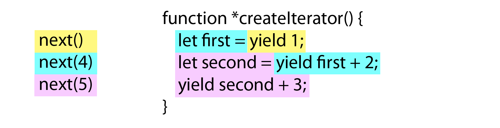
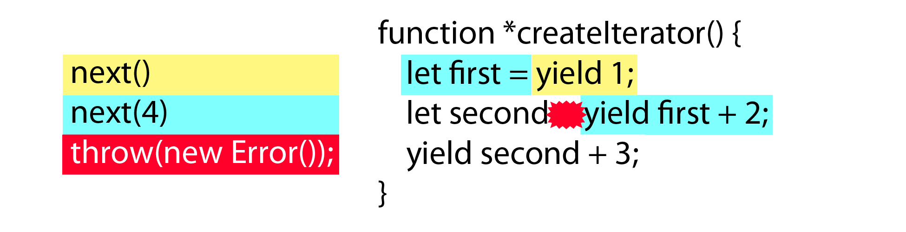

# Iterators and Generators

Many programming languages have shifted from iterating over data with `for` loops, which require initializing variables to track position in a collection, to using iterator objects that programmatically return the next item in a collection. Iterators make working with collections of data easier, and ECMAScript 6 adds iterators to JavaScript. When coupled with new array methods and new types of collections (such as sets and maps), iterators are key for efficient data processing, and you will find them in many parts of the language. There's a new `for-of` loop that works with iterators, the spread (`...`) operator uses iterators, and iterators even make asynchronous programming easier.

This chapter covers the many uses of iterators, but first, it's important to understand the history behind why iterators were added to JavaScript.

## The Loop Problem

If you've ever programmed in JavaScript, you've probably written code that looks like this:

```js
var colors = ["red", "green", "blue"];

for (var i = 0, len = colors.length; i < len; i++) {
    console.log(colors[i]);
}
```

This standard `for` loop tracks the index into the `colors` array with the `i` variable. The value of `i` increments each time the loop executes if `i` isn't larger than the length of the array (stored in `len`).

While this loop is fairly straightforward, loops grow in complexity when you nest them and need to keep track of multiple variables. Additional complexity can lead to errors, and the boilerplate nature of the `for` loop lends itself to more errors as similar code is written in multiple places. Iterators are meant to solve that problem.

## What are Iterators?

Iterators are just objects with a specific interface designed for iteration. All iterator objects have a `next()` method that returns a result object. The result object has two properties: `value`, which is the next value, and `done`, which is a boolean that's `true` when there are no more values to return. The iterator keeps an internal pointer to a location within a collection of values and with each call to the `next()` method, it returns the next appropriate value.

If you call `next()` after the last value has been returned, the method returns `done` as `true` and `value` contains the *return value* for the iterator. That return value is not part of the data set, but rather a final piece of related data, or `undefined` if no such data exists. An iterator's return value is similar to a function's return value in that it's a final way to pass information to the caller.

With that in mind, creating an iterator using ECMAScript 5 is fairly straightforward:

```js
function createIterator(items) {

    var i = 0;

    return {
        next: function() {

            var done = (i >= items.length);
            var value = !done ? items[i++] : undefined;

            return {
                done: done,
                value: value
            };

        }
    };
}

var iterator = createIterator([1, 2, 3]);

console.log(iterator.next());           // "{ value: 1, done: false }"
console.log(iterator.next());           // "{ value: 2, done: false }"
console.log(iterator.next());           // "{ value: 3, done: false }"
console.log(iterator.next());           // "{ value: undefined, done: true }"

// for all further calls
console.log(iterator.next());           // "{ value: undefined, done: true }"
```

The `createIterator()` function returns an object with a `next()` method. Each time the method is called, the next value in the `items` array is returned as `value`. When `i` is 3, `done` becomes `true` and the ternary conditional operator that sets `value` evaluates to `undefined`. These two results fulfill the special last case for iterators in ECMAScript 6, where `next()` is called on an iterator after the last piece of data has been used.

As this example shows, writing iterators that behave according to the rules laid out in ECMAScript 6 is a bit complex.

Fortunately, ECMAScript 6 also provides generators, which make creating iterator objects much simpler.

## What Are Generators?

A *generator* is a function that returns an iterator. Generator functions are indicated by a star character (`*`) after the `function` keyword and use the new `yield` keyword. It doesn't matter if the star is directly next to `function` or if there's some whitespace between it and the `*` character, as in this example:

```js
// generator
function *createIterator() {
    yield 1;
    yield 2;
    yield 3;
}

// generators are called like regular functions but return an iterator
let iterator = createIterator();

console.log(iterator.next().value);     // 1
console.log(iterator.next().value);     // 2
console.log(iterator.next().value);     // 3
```

The `*` before `createIterator()` makes this function a generator. The `yield` keyword, also new to ECMAScript 6, specifies values the resulting iterator should return when `next()` is called, in the order they should be returned. The iterator generated in this example has three different values to return on successive calls to the `next()` method: first `1`, then `2`, and finally `3`. A generator gets called like any other function, as shown when `iterator` is created.

Perhaps the most interesting aspect of generator functions is that they stop execution after each `yield` statement. For instance, after `yield 1` executes in this code, the function doesn't execute anything else until the iterator's `next()` method is called. At that point, `yield 2` executes. This ability to stop execution in the middle of a function is extremely powerful and leads to some interesting uses of generator functions (discussed in the "Advanced Iterator Functionality" section).

The `yield` keyword can be used with any value or expression, so you can write generator functions that add items to iterators without just listing the items one by one. For example, here's one way you could use `yield` inside a `for` loop:

```js
function *createIterator(items) {
    for (let i = 0; i < items.length; i++) {
        yield items[i];
    }
}

let iterator = createIterator([1, 2, 3]);

console.log(iterator.next());           // "{ value: 1, done: false }"
console.log(iterator.next());           // "{ value: 2, done: false }"
console.log(iterator.next());           // "{ value: 3, done: false }"
console.log(iterator.next());           // "{ value: undefined, done: true }"

// for all further calls
console.log(iterator.next());           // "{ value: undefined, done: true }"
```

This example passes an array called `items` to the `createIterator()` generator function. Inside the function, a `for` loop yields the elements from the array into the iterator as the loop progresses. Each time `yield` is encountered, the loop stops, and each time `next()` is called on `iterator`, the loop picks up with the next `yield` statement.

Generator functions are an important feature of ECMAScript 6, and since they are just functions, they can be used in all the same places. The rest of this section focuses on other useful ways to write generators.

W> The `yield` keyword can only be used inside of generators. Use of `yield` anywhere else is a syntax error, including functions that are inside of generators, such as:
W>
W> ```js
W> function *createIterator(items) {
W>
W>     items.forEach(function(item) {
W>
W>         // syntax error
W>         yield item + 1;
W>     });
W> }
W> ```
W>
W> Even though `yield` is technically inside of `createIterator()`, this code is a syntax error because `yield` cannot cross function boundaries. In this way, `yield` is similar to `return`, in that a nested function cannot return a value for its containing function.

### Generator Function Expressions

You can use function expressions to create generators by just including a star (`*`) character between the `function` keyword and the opening parenthesis. For example:

```js
let createIterator = function *(items) {
    for (let i = 0; i < items.length; i++) {
        yield items[i];
    }
};

let iterator = createIterator([1, 2, 3]);

console.log(iterator.next());           // "{ value: 1, done: false }"
console.log(iterator.next());           // "{ value: 2, done: false }"
console.log(iterator.next());           // "{ value: 3, done: false }"
console.log(iterator.next());           // "{ value: undefined, done: true }"

// for all further calls
console.log(iterator.next());           // "{ value: undefined, done: true }"
```

In this code, `createIterator()` is a generator function expression instead of a function declaration. The asterisk goes between the `function` keyword and the opening parentheses because the function expression is anonymous. Otherwise, this example is the same as the previous version of the `createIterator()` function, which also used a `for` loop.

I> Creating an arrow function that is also a generator is not possible.

### Generator Object Methods

Because generators are just functions, they can be added to objects, too. For example, you can make a generator in an ECMAScript 5-style object literal with a function expression:

```js
var o = {

    createIterator: function *(items) {
        for (let i = 0; i < items.length; i++) {
            yield items[i];
        }
    }
};

let iterator = o.createIterator([1, 2, 3]);
```

You can also use the ECMAScript 6 method shorthand by prepending the method name with a star (`*`):

```js
var o = {

    *createIterator(items) {
        for (let i = 0; i < items.length; i++) {
            yield items[i];
        }
    }
};

let iterator = o.createIterator([1, 2, 3]);
```

These examples are functionally equivalent to the example in the "Generator Function Expressions" section; they just use different syntax. In the shorthand version, because the `createIterator()` method is defined with no `function` keyword, the star is placed immediately before the method name, though you can leave whitespace between the star and the method name.

## Iterables and for-of

Closely related to iterators, an *iterable* is an object with a `Symbol.iterator` property. The well-known `Symbol.iterator` symbol specifies a function that returns an iterator for the given object. All collection objects (arrays, sets, and maps) and strings are iterables in ECMAScript 6 and so they have a default iterator specified. Iterables are designed to be used with a new addition to ECMAScript: the `for-of` loop.

I> All iterators created by generators are also iterables, as generators assign the `Symbol.iterator` property by default.

At the beginning of this chapter, I mentioned the problem of tracking an index inside a `for` loop. Iterators are the first part of the solution to that problem. The `for-of` loop is the second part: it removes the need to track an index into a collection entirely, leaving you free to focus on working with the contents of the collection.

A `for-of` loop calls `next()` on an iterable each time the loop executes and stores the `value` from the result object in a variable. The loop continues this process until the returned object's `done` property is `true`. Here's an example:

```js
let values = [1, 2, 3];

for (let num of values) {
    console.log(num);
}
```

This code outputs the following:

```
1
2
3
```

This `for-of` loop first calls the `Symbol.iterator` method on the `values` array to retrieve an iterator. (The call to `Symbol.iterator` happens behind the scenes in the JavaScript engine itself.) Then `iterator.next()` is called, and the `value` property on the iterator's result object is read into `num`. The `num` variable is first 1, then 2, and finally 3. When `done` on the result object is `true`, the loop exits, so `num` is never assigned the value of `undefined`.

If you are simply iterating over values in an array or collection, then it's a good idea to use a `for-of` loop instead of a `for` loop. The `for-of` loop is generally less error-prone because there are fewer conditions to keep track of. Save the traditional `for` loop for more complex control conditions.

W> The `for-of` statement will throw an error when used on, a non-iterable object, `null`, or `undefined`.

### Accessing the Default Iterator

You can use `Symbol.iterator` to access the default iterator for an object, like this:

```js
let values = [1, 2, 3];
let iterator = values[Symbol.iterator]();

console.log(iterator.next());           // "{ value: 1, done: false }"
console.log(iterator.next());           // "{ value: 2, done: false }"
console.log(iterator.next());           // "{ value: 3, done: false }"
console.log(iterator.next());           // "{ value: undefined, done: true }"
```

This code gets the default iterator for `values` and uses that to iterate over the items in the array. This is the same process that happens behind-the-scenes when using a `for-of` loop.

Since `Symbol.iterator` specifies the default iterator, you can use it to detect whether an object is iterable as follows:

```js
function isIterable(object) {
    return typeof object[Symbol.iterator] === "function";
}

console.log(isIterable([1, 2, 3]));     // true
console.log(isIterable("Hello"));       // true
console.log(isIterable(new Map()));     // true
console.log(isIterable(new Set()));     // true
console.log(isIterable(new WeakMap())); // false
console.log(isIterable(new WeakSet())); // false
```

The `isIterable()` function simply checks to see if a default iterator exists on the object and is a function. The `for-of` loop does a similar check before executing.

So far, the examples in this section have shown ways to use `Symbol.iterator` with built-in iterable types, but you can also use the `Symbol.iterator` property to create your own iterables.

### Creating Iterables

Developer-defined objects are not iterable by default, but you can make them iterable by creating a `Symbol.iterator` property containing a generator. For example:

```js
let collection = {
    items: [],
    *[Symbol.iterator]() {
        for (let item of this.items) {
            yield item;
        }
    }

};

collection.items.push(1);
collection.items.push(2);
collection.items.push(3);

for (let x of collection) {
    console.log(x);
}
```

This code outputs the following:

```
1
2
3
```

First, the example defines a default iterator for an object called `collection`. The default iterator is created by the `Symbol.iterator` method, which is a generator (note the star still comes before the name). The generator then uses a `for-of` loop to iterate over the values in `this.items` and uses `yield` to return each one. Instead of manually iterating to define values for the default iterator of `collection` to return, the `collection` object relies on the default iterator of `this.items` to do the work.

I> "Delegating Generators" later in this chapter describes a different approach to using the iterator of another object.

Now you've seen some uses for the default array iterator, but there are many more iterators built in to ECMAScript 6 to make working with collections of data easy.

## Built-in Iterators

Iterators are an important part of ECMAScript 6, and as such, you don't need to create your own iterators for many built-in types; the language includes them by default. You only need to create iterators when the built-in iterators don't serve your purpose, which will most frequently be when defining your own objects or classes. Otherwise, you can rely on built-in iterators to do your work. Perhaps the most common iterators to use are those that work on collections.

### Collection Iterators

ECMAScript 6 has three types of collection objects: arrays, maps, and sets. All three have the following built-in iterators to help you navigate their content:

* `entries()` - Returns an iterator whose values are a key-value pair
* `values()` - Returns an iterator whose values are the values of the collection
* `keys()` - Returns an iterator whose values are the keys contained in the collection

You can retrieve an iterator for a collection by calling one of these methods.

#### The entries() Iterator

The `entries()` iterator returns a two-item array each time `next()` is called. The two-item array represents the key and value for each item in the collection. For arrays, the first item is the numeric index; for sets, the first item is also the value (since values double as keys in sets); for maps, the first item is the key.

Here are some examples that use this iterator:

```js
let colors = [ "red", "green", "blue" ];
let tracking = new Set([1234, 5678, 9012]);
let data = new Map();

data.set("title", "Understanding ECMAScript 6");
data.set("format", "ebook");

for (let entry of colors.entries()) {
    console.log(entry);
}

for (let entry of tracking.entries()) {
    console.log(entry);
}

for (let entry of data.entries()) {
    console.log(entry);
}
```

The `console.log()` calls give the following output:

```
[0, "red"]
[1, "green"]
[2, "blue"]
[1234, 1234]
[5678, 5678]
[9012, 9012]
["title", "Understanding ECMAScript 6"]
["format", "ebook"]
```

This code uses the `entries()` method on each type of collection to retrieve an iterator, and it uses `for-of` loops to iterate the items. The console output shows how the keys and values are returned in pairs for each object.

#### The values() Iterator

The `values()` iterator simply returns values as they are stored in the collection. For example:

```js
let colors = [ "red", "green", "blue" ];
let tracking = new Set([1234, 5678, 9012]);
let data = new Map();

data.set("title", "Understanding ECMAScript 6");
data.set("format", "ebook");

for (let value of colors.values()) {
    console.log(value);
}

for (let value of tracking.values()) {
    console.log(value);
}

for (let value of data.values()) {
    console.log(value);
}
```

This code outputs the following:

```
"red"
"green"
"blue"
1234
5678
9012
"Understanding ECMAScript 6"
"ebook"
```

Calling the `values()` iterator, as in this example, returns the exact data contained in each collection without any information about that data's location in the collection.

#### The keys() Iterator

The `keys()` iterator returns each key present in a collection. For arrays, it only returns numeric keys, never other own properties of the array. For sets, the keys are the same as the values, and so `keys()` and `values()` return the same iterator. For maps, the `keys()` iterator returns each unique key. Here's an example that demonstrates all three:

```js
let colors = [ "red", "green", "blue" ];
let tracking = new Set([1234, 5678, 9012]);
let data = new Map();

data.set("title", "Understanding ECMAScript 6");
data.set("format", "ebook");

for (let key of colors.keys()) {
    console.log(key);
}

for (let key of tracking.keys()) {
    console.log(key);
}

for (let key of data.keys()) {
    console.log(key);
}
```

This example outputs the following:

```
0
1
2
1234
5678
9012
"title"
"format"
```

The `keys()` iterator fetches each key in `colors`, `tracking`, and `data`, and those keys are printed from inside the three `for-of` loops. For the array object, only numeric indices are printed, which would still happen even if you added named properties to the array. This is different from the way the `for-in` loop works with arrays, because the `for-in` loop iterates over properties rather than just the numeric indices.

#### Default Iterators for Collection Types

Each collection type also has a default iterator that is used by `for-of` whenever an iterator isn't explicitly specified. The `values()` method is the default iterator for arrays and sets, while the `entries()` method is the default iterator for maps. These defaults make using collection objects in `for-of` loops a little easier. For instance, consider this example:

```js
let colors = [ "red", "green", "blue" ];
let tracking = new Set([1234, 5678, 9012]);
let data = new Map();

data.set("title", "Understanding ECMAScript 6");
data.set("format", "print");

// same as using colors.values()
for (let value of colors) {
    console.log(value);
}

// same as using tracking.values()
for (let num of tracking) {
    console.log(num);
}

// same as using data.entries()
for (let entry of data) {
    console.log(entry);
}
```

No iterator is specified, so the default iterator functions will be used. The default iterators for arrays, sets, and maps are designed to reflect how these objects are initialized, so this code outputs the following:

```
"red"
"green"
"blue"
1234
5678
9012
["title", "Understanding ECMAScript 6"]
["format", "print"]
```

Arrays and sets return their values by default, while maps return the same array format that can be passed into the `Map` constructor. Weak sets and weak maps, on the other hand, do not have built-in iterators. Managing weak references means there's no way to know exactly how many values are in these collections, which also means there's no way to iterate over them.

A> ### Destructuring and for-of Loops
A>
A> The behavior of the default iterator for maps is also helpful when used in `for-of` loops with destructuring, as in this example:
A>
A> ```js
A> let data = new Map();
A>
A> data.set("title", "Understanding ECMAScript 6");
A> data.set("format", "ebook");
A>
A> // same as using data.entries()
A> for (let [key, value] of data) {
A>     console.log(key + "=" + value);
A> }
A> ```
A>
A> The `for-of` loop in this code uses a destructured array to assign `key` and `value` for each entry in the map. In this way, you can easily work with keys and values at the same time without needing to access a two-item array or going back to the map to fetch either the key or the value. Using a destructured array for maps makes the `for-of` loop equally useful for maps as it is for sets and arrays.

### String Iterators

JavaScript strings have slowly become more like arrays since ECMAScript 5 was released. For example, ECMAScript 5 formalized bracket notation for accessing characters in strings (that is, using `text[0]` to get the first character, and so on). But bracket notation works on code units rather than characters, so it cannot be used to access double-byte characters correctly, as this example demonstrates:

```js
var message = "A 𠮷 B";

for (let i=0; i < message.length; i++) {
    console.log(message[i]);
}
```

This code uses bracket notation and the `length` property to iterate over and print a string containing a Unicode character. The output is a bit unexpected:

```
A
(blank)
(blank)
(blank)
(blank)
B
```

Since the double-byte character is treated as two separate code units, there are four empty lines between `A` and `B` in the output.

Fortunately, ECMAScript 6 aims to fully support Unicode (see Chapter 2), and the default string iterator is an attempt to solve the string iteration problem. As such, the default iterator for strings works on characters rather than code units. Changing this example to use the default string iterator with a `for-of` loop results in more appropriate output. Here's the tweaked code:


```js
var message = "A 𠮷 B";

for (let c of message) {
    console.log(c);
}
```

This outputs the following:

```
A
(blank)
𠮷
(blank)
B
```

This result is more in line with what you'd expect when working with characters: the loop successfully prints the Unicode character, as well as all the rest.

### NodeList Iterators

The Document Object Model (DOM) has a `NodeList` type that represents a collection of elements in a document. For those who write JavaScript to run in web browsers, understanding the difference between `NodeList` objects and arrays has always been a bit difficult. Both `NodeList` objects and arrays use the `length` property to indicate the number of items, and both use bracket notation to access individual items. Internally, however, a `NodeList` and an array behave quite differently, which has led to a lot of confusion.

With the addition of default iterators in ECMAScript 6, the DOM definition of `NodeList` (included in the HTML specification rather than ECMAScript 6 itself) includes a default iterator that behaves in the same manner as the array default iterator. That means you can use `NodeList` in a `for-of` loop or any other place that uses an object's default iterator. For example:

```js
var divs = document.getElementsByTagName("div");

for (let div of divs) {
    console.log(div.id);
}
```

This code calls `getElementsByTagName()` to retrieve a `NodeList` that represents all of the `<div>` elements in the `document` object. The `for-of` loop then iterates over each element and outputs the element IDs, effectively making the code the same as it would be for a standard array.

## The Spread Operator and Non-Array Iterables

Recall from Chapter 7 that the spread operator (`...`) can be used to convert a set into an array. For example:

```js
let set = new Set([1, 2, 3, 3, 3, 4, 5]),
    array = [...set];

console.log(array);             // [1,2,3,4,5]
```

This code uses the spread operator inside an array literal to fill in that array with the values from `set`. The spread operator works on all iterables and uses the default iterator to determine which values to include. All values are read from the iterator and inserted into the array in the order in which values were returned from the iterator. This example works because sets are iterables, but it can work equally well on any iterable. Here's another example:

```js
let map = new Map([ ["name", "Nicholas"], ["age", 25]]),
    array = [...map];

console.log(array);         // [ ["name", "Nicholas"], ["age", 25]]
```

Here, the spread operator converts `map` into an array of arrays. Since the default iterator for maps returns key-value pairs, the resulting array looks like the array that was passed during the `new Map()` call.

You can use the spread operator in an array literal as many times as you want, and you can use it wherever you want to insert multiple items from an iterable. Those items will just appear in order in the new array at the location of the spread operator. For example:

```js
let smallNumbers = [1, 2, 3],
    bigNumbers = [100, 101, 102],
    allNumbers = [0, ...smallNumbers, ...bigNumbers];

console.log(allNumbers.length);     // 7
console.log(allNumbers);    // [0, 1, 2, 3, 100, 101, 102]
```

The spread operator is used to create `allNumbers` from the values in `smallNumbers` and `bigNumbers`. The values are placed in `allNumbers` in the same order the arrays are added when `allNumbers` is created: `0` is first, followed by the values from `smallNumbers`, followed by the values from `bigNumbers`. The original arrays are unchanged, though, as their values have just been copied into `allNumbers`.

Since the spread operator can be used on any iterable, it's the easiest way to convert an iterable into an array. You can convert strings into arrays of characters (not code units) and `NodeList` objects in the browser into arrays of nodes.

Now that you understand the basics of how iterators work, including `for-of` and the spread operator, it's time to look at some more complex uses of iterators.

## Advanced Iterator Functionality

You can accomplish a lot with the basic functionality of iterators and the convenience of creating them using generators. However, iterators are much more powerful when used for tasks other than simply iterating over a collection of values. During the development of ECMAScript 6, a lot of unique ideas and patterns emerged that encouraged the creators to add more functionality. Some of those additions are subtle, but when used together, can accomplish some interesting interactions.

### Passing Arguments to Iterators

Throughout this chapter, examples have shown iterators passing values out via the `next()` method or by using `yield` in a generator. But you can also pass arguments to the iterator through the `next()` method. When an argument is passed to the `next()` method, that argument becomes the value of the `yield` statement inside a generator. This capability is important for more advanced functionality such as asynchronous programming. Here's a basic example:

```js
function *createIterator() {
    let first = yield 1;
    let second = yield first + 2;       // 4 + 2
    yield second + 3;                   // 5 + 3
}

let iterator = createIterator();

console.log(iterator.next());           // "{ value: 1, done: false }"
console.log(iterator.next(4));          // "{ value: 6, done: false }"
console.log(iterator.next(5));          // "{ value: 8, done: false }"
console.log(iterator.next());           // "{ value: undefined, done: true }"
```

The first call to `next()` is a special case where any argument passed to it is lost. Since arguments passed to `next()` become the values returned by `yield`, an argument from the first call to `next()` could only replace the first yield statement in the generator function if it could be accessed before that `yield` statement. That's not possible, so there's no reason to pass an argument the first time `next()` is called.

On the second call to `next()`, the value `4` is passed as the argument. The `4` ends up assigned to the variable `first` inside the generator function. In a `yield` statement including an assignment, the right side of the expression is evaluated on the first call to `next()` and the left side is evaluated on the second call to `next()` before the function continues executing. Since the second call to `next()` passes in `4`, that value is assigned to `first` and then execution continues.

The second `yield` uses the result of the first `yield` and adds two, which means it returns a value of six. When `next()` is called a third time, the value `5` is passed as an argument. That value is assigned to the variable `second` and then used in the third `yield` statement to return `8`.

It's a bit easier to think about what's happening by considering which code is executing each time execution continues inside the generator function. Figure 8-1 uses colors to show the code being executed before yielding.



The color yellow represents the first call to `next()` and all the code executed inside of the generator as a result. The color aqua represents the call to `next(4)` and the code that is executed with that call. The color purple represents the call to `next(5)` and the code that is executed as a result. The tricky part is how the code on the right side of each expression executes and stops before the left side is executed. This makes debugging complicated generators a bit more involved than debugging regular functions.

So far, you've seen that `yield` can act like `return` when a value is passed to the `next()` method. However, that's not the only execution trick you can do inside a generator. You can also cause iterators throw an error.

### Throwing Errors in Iterators

It's possible to pass not just data into iterators but also error conditions. Iterators can choose to implement a `throw()` method that instructs the iterator to throw an error when it resumes. This is an important capability for asynchronous programming, but also for flexibility inside generators, where you want to be able to mimic both return values and thrown errors (the two ways of exiting a function). You can pass an error object to `throw()` that should be thrown when the iterator continues processing. For example:

```js
function *createIterator() {
    let first = yield 1;
    let second = yield first + 2;       // yield 4 + 2, then throw
    yield second + 3;                   // never is executed
}

let iterator = createIterator();

console.log(iterator.next());                   // "{ value: 1, done: false }"
console.log(iterator.next(4));                  // "{ value: 6, done: false }"
console.log(iterator.throw(new Error("Boom"))); // error thrown from generator
```

In this example, the first two `yield` expressions are evaluated as normal, but when `throw()` is called, an error is thrown before `let second` is evaluated. This effectively halts code execution similar to directly throwing an error. The only difference is the location in which the error is thrown. Figure 8-2 shows which code is executed at each step.



In this figure, the color red represents the code executed when `throw()` is called, and the red star shows approximately when the error is thrown inside the generator. The first two `yield` statements are executed, and when `throw()` is called, an error is thrown before any other code executes.

Knowing this, you can catch such errors inside the generator using a `try-catch` block:

```js
function *createIterator() {
    let first = yield 1;
    let second;

    try {
        second = yield first + 2;       // yield 4 + 2, then throw
    } catch (ex) {
        second = 6;                     // on error, assign a different value
    }
    yield second + 3;
}

let iterator = createIterator();

console.log(iterator.next());                   // "{ value: 1, done: false }"
console.log(iterator.next(4));                  // "{ value: 6, done: false }"
console.log(iterator.throw(new Error("Boom"))); // "{ value: 9, done: false }"
console.log(iterator.next());                   // "{ value: undefined, done: true }"
```

In this example, a `try-catch` block is wrapped around the second `yield` statement. While this `yield` executes without error, the error is thrown before any value can be assigned to `second`, so the `catch` block assigns it a value of six. Execution then flows to the next `yield` and returns nine.

Notice that something interesting happened: the `throw()` method returned a result object just like the `next()` method. Because the error was caught inside the generator, code execution continued on to the next `yield` and returned the next value, `9`.

It helps to think of `next()` and `throw()` as both being instructions to the iterator. The `next()` method instructs the iterator to continue executing (possibly with a given value) and `throw()` instructs the iterator to continue executing by throwing an error. What happens after that point depends on the code inside the generator.

The `next()` and `throw()` methods control execution inside an iterator when using `yield`, but you can also use the `return` statement. But `return` works a bit differently than it does in regular functions, as you will see in the next section.

### Generator Return Statements

Since generators are functions, you can use the `return` statement both to exit early and  specify a return value for the last call to the `next()` method. In most examples in this chapter, the last call to `next()` on an iterator returns `undefined`, but you can specify an alternate value by using `return` as you would in any other function. In a generator, `return` indicates that all processing is done, so the `done` property is set to `true` and the value, if provided, becomes the `value` field. Here's an example that simply exits early using `return`:

```js
function *createIterator() {
    yield 1;
    return;
    yield 2;
    yield 3;
}

let iterator = createIterator();

console.log(iterator.next());           // "{ value: 1, done: false }"
console.log(iterator.next());           // "{ value: undefined, done: true }"
```

In this code, the generator has a `yield` statement followed by a `return` statement. The `return` indicates that there are no more values to come, and so the rest of the `yield` statements will not execute (they are unreachable).

You can also specify a return value that will end up in the `value` field of the returned object. For example:

```js
function *createIterator() {
    yield 1;
    return 42;
}

let iterator = createIterator();

console.log(iterator.next());           // "{ value: 1, done: false }"
console.log(iterator.next());           // "{ value: 42, done: true }"
console.log(iterator.next());           // "{ value: undefined, done: true }"
```

Here, the value `42` is returned in the `value` field on the second call to the `next()` method (which is the first time that `done` is `true`). The third call to `next()` returns an object whose `value` property is once again `undefined`. Any value you specify with `return` is only available on the returned object one time before the `value` field is reset to `undefined`.

I> The spread operator and `for-of` ignore any value specified by a `return` statement. As soon as they see `done` is `true`, they stop without reading the `value`. Iterator return values are helpful, however, when delegating generators.

### Delegating Generators

In some cases, combining the values from two iterators into one is useful. Generators can delegate to other iterators using a special form of `yield` with a star (`*`) character. As with generator definitions, where the star appears doesn't matter, as long as the star falls between the `yield` keyword and the generator function name. Here's an example:

```js
function *createNumberIterator() {
    yield 1;
    yield 2;
}

function *createColorIterator() {
    yield "red";
    yield "green";
}

function *createCombinedIterator() {
    yield *createNumberIterator();
    yield *createColorIterator();
    yield true;
}

var iterator = createCombinedIterator();

console.log(iterator.next());           // "{ value: 1, done: false }"
console.log(iterator.next());           // "{ value: 2, done: false }"
console.log(iterator.next());           // "{ value: "red", done: false }"
console.log(iterator.next());           // "{ value: "green", done: false }"
console.log(iterator.next());           // "{ value: true, done: false }"
console.log(iterator.next());           // "{ value: undefined, done: true }"
```

In this example, the `createCombinedIterator()` generator delegates first to the iterator returned from `createNumberIterator()` and then to the iterator returned from `createColorIterator()`. The iterator returned from `createCombinedIterator()` appears, from the outside, to be one consistent iterator that has produced all of the values. Each call to `next()` is delegated to the appropriate iterator until the iterators created by `createNumberIterator()` and `createColorIterator()` are empty. Then the final `yield` is executed to return `true`.

Generator delegation also lets you make further use of generator return values. This is the easiest way to access such returned values and can be quite useful in performing complex tasks. For example:

```js
function *createNumberIterator() {
    yield 1;
    yield 2;
    return 3;
}

function *createRepeatingIterator(count) {
    for (let i=0; i < count; i++) {
        yield "repeat";
    }
}

function *createCombinedIterator() {
    let result = yield *createNumberIterator();
    yield *createRepeatingIterator(result);
}

var iterator = createCombinedIterator();

console.log(iterator.next());           // "{ value: 1, done: false }"
console.log(iterator.next());           // "{ value: 2, done: false }"
console.log(iterator.next());           // "{ value: "repeat", done: false }"
console.log(iterator.next());           // "{ value: "repeat", done: false }"
console.log(iterator.next());           // "{ value: "repeat", done: false }"
console.log(iterator.next());           // "{ value: undefined, done: true }"
```

Here, the `createCombinedIterator()` generator delegates to `createNumberIterator()` and assigns the return value to `result`. Since `createNumberIterator()` contains `return 3`, the returned value is `3`. The `result` variable is then passed to `createRepeatingIterator()` as an argument indicating how many times to yield the same string (in this case, three times).

Notice that the value `3` was never output from any call to the `next()` method. Right now, it exists solely inside the `createCombinedIterator()` generator. But you can output that value as well by adding another `yield` statement, such as:

```js
function *createNumberIterator() {
    yield 1;
    yield 2;
    return 3;
}

function *createRepeatingIterator(count) {
    for (let i=0; i < count; i++) {
        yield "repeat";
    }
}

function *createCombinedIterator() {
    let result = yield *createNumberIterator();
    yield result;
    yield *createRepeatingIterator(result);
}

var iterator = createCombinedIterator();

console.log(iterator.next());           // "{ value: 1, done: false }"
console.log(iterator.next());           // "{ value: 2, done: false }"
console.log(iterator.next());           // "{ value: 3, done: false }"
console.log(iterator.next());           // "{ value: "repeat", done: false }"
console.log(iterator.next());           // "{ value: "repeat", done: false }"
console.log(iterator.next());           // "{ value: "repeat", done: false }"
console.log(iterator.next());           // "{ value: undefined, done: true }"
```

In this code, the extra `yield` statement explicitly outputs the returned value from the `createNumberIterator()` generator.

Generator delegation using the return value is a very powerful paradigm that allows for some very interesting possibilities, especially when used in conjunction with asynchronous operations.

I> You can use `yield *` directly on strings (such as `yield * "hello"`) and the string's default iterator will be used.

## Asynchronous Task Running

A lot of the excitement around generators is directly related to asynchronous programming. Asynchronous programming in JavaScript is a double-edged sword: simple tasks are easy to do asynchronously, while complex tasks become an errand in code organization. Since generators allow you to effectively pause code in the middle of execution, they open up a lot of possibilities related to asynchronous processing.

The traditional way to perform asynchronous operations is to call a function that has a callback. For example, consider reading a file from the disk in Node.js:

```js
let fs = require("fs");

fs.readFile("config.json", function(err, contents) {
    if (err) {
        throw err;
    }

    doSomethingWith(contents);
    console.log("Done");
});
```

The `fs.readFile()` method is called with the filename to read and a callback function. When the operation is finished, the callback function is called. The callback checks to see if there's an error, and if not, processes the returned `contents`. This works well when you have a small, finite number of asynchronous tasks to complete, but gets complicated when you need to nest callbacks or otherwise sequence a series of asynchronous tasks. This is where generators and `yield` are helpful.

### A Simple Task Runner

Because `yield` stops execution and waits for the `next()` method to be called before starting again, you can implement asynchronous calls without managing callbacks. To start, you need a function that can call a generator and start the iterator, such as this:

```js
function run(taskDef) {

    // create the iterator, make available elsewhere
    let task = taskDef();

    // start the task
    let result = task.next();

    // recursive function to keep calling next()
    function step() {

        // if there's more to do
        if (!result.done) {
            result = task.next();
            step();
        }
    }

    // start the process
    step();

}
```

The `run()` function accepts a task definition (a generator function) as an argument. It calls the generator to create an iterator and stores the iterator in `task`. The `task` variable is outside the function so it can be accessed by other functions; I will explain why later in this section. The first call to `next()` begins the iterator and the result is stored for later use. The `step()` function checks to see if `result.done` is false and, if so, calls `next()` before recursively calling itself. Each call to `next()` stores the return value in `result`, which is always overwritten to contain the latest information. The initial call to `step()` starts the process of looking at the `result.done` variable to see whether there's more to do.

With this implementation of `run()`, you can run a generator containing multiple `yield` statements, such as:

```js
run(function*() {
    console.log(1);
    yield;
    console.log(2);
    yield;
    console.log(3);
});
```

This example just outputs three numbers to the console, which simply shows that all calls to `next()` are being made. However, just yielding a couple of times isn't very useful. The next step is to pass values into and out of the iterator.

### Task Running With Data

The easiest way to pass data through the task runner is to pass the value specified by `yield` into the next call to the `next()` method. To do so, you need only pass `result.value`, as in this code:

```js
function run(taskDef) {

    // create the iterator, make available elsewhere
    let task = taskDef();

    // start the task
    let result = task.next();

    // recursive function to keep calling next()
    function step() {

        // if there's more to do
        if (!result.done) {
            result = task.next(result.value);
            step();
        }
    }

    // start the process
    step();

}
```

Now that `result.value` is passed to `next()` as an argument, it's possible to pass data between `yield` calls, like this:

```js
run(function*() {
    let value = yield 1;
    console.log(value);         // 1

    value = yield value + 3;
    console.log(value);         // 4
});
```

This example outputs two values to the console: 1 and 4. The value 1 comes from `yield 1`, as the 1 is passed right back into the `value` variable. The 4 is calculated by adding 3 to `value` and passing that result back to `value`. Now that data is flowing between calls to `yield`, you just need one small change to allow asynchronous calls.

### Asynchronous Task Runner

The previous example passed static data back and forth between `yield` calls, but waiting for an asynchronous process is slightly different. The task runner needs to know about callbacks and how to use them. And since `yield` expressions pass their values into the task runner, that means any function call must return a value that somehow indicates the call is an asynchronous operation that the task runner should wait for.

Here's one way you might signal that a value is an asynchronous operation:

```js
function fetchData() {
    return function(callback) {
        callback(null, "Hi!");
    };
}
```

For the purposes of this example, any function meant to be called by the task runner will return a function that executes a callback. The `fetchData()` function returns a function that accepts a callback function as an argument. When the returned function is called, it executes the callback function with a single piece of data (the `"Hi!"` string). The `callback` argument needs to come from the task runner to ensure executing the callback correctly interacts with the underlying iterator. While the `fetchData()` function is synchronous, you can easily extend it to be asynchronous by calling the callback with a slight delay, such as:

```js
function fetchData() {
    return function(callback) {
        setTimeout(function() {
            callback(null, "Hi!");
        }, 50);
    };
}
```

This version of `fetchData()` introduces a 50ms delay before calling the callback, demonstrating that this pattern works equally well for synchronous and asynchronous code. You just have to make sure each function that wants to be called using `yield` follows the same pattern.

With a good understanding of how a function can signal that it's an asynchronous process, you can modify the task runner to take that fact into account. Anytime `result.value` is a function, the task runner will execute it instead of just passing that value to the `next()` method. Here's the updated code:

```js
function run(taskDef) {

    // create the iterator, make available elsewhere
    let task = taskDef();

    // start the task
    let result = task.next();

    // recursive function to keep calling next()
    function step() {

        // if there's more to do
        if (!result.done) {
            if (typeof result.value === "function") {
                result.value(function(err, data) {
                    if (err) {
                        result = task.throw(err);
                        return;
                    }

                    result = task.next(data);
                    step();
                });
            } else {
                result = task.next(result.value);
                step();
            }

        }
    }

    // start the process
    step();

}
```

When `result.value` is a function (checked with the `===` operator), it is called with a callback function. That callback function follows the Node.js convention of passing any possible error as the first argument (`err`) and the result as the second argument. If `err` is present, then that means an error occurred and `task.throw()` is called with the error object instead of `task.next()` so an error is thrown at the correct location. If there is no error, then `data` is passed into `task.next()` and the result is stored. Then, `step()` is called to continue the process. When `result.value` is not a function, it is directly passed to the `next()` method.

This new version of the task runner is ready for all asynchronous tasks. To read data from a file in Node.js, you need to create a wrapper around `fs.readFile()` that returns a function similar to the `fetchData()` function from the beginning of this section. For example:

```js
let fs = require("fs");

function readFile(filename) {
    return function(callback) {
        fs.readFile(filename, callback);
    };
}
```

The `readFile()` method accepts a single argument, the filename, and returns a function that calls a callback. The callback is passed directly to the `fs.readFile()` method, which will execute the callback upon completion. You can then run this task using `yield` as follows:

```js
run(function*() {
    let contents = yield readFile("config.json");
    doSomethingWith(contents);
    console.log("Done");
});
```

This example is performing the asynchronous `readFile()` operation without making any callbacks visible in the main code. Aside from `yield`, the code looks the same as synchronous code. As long as the functions performing asynchronous operations all conform to the same interface, you can write logic that reads like synchronous code.

Of course, there are downsides to the pattern used in these examples--namely that you can't always be sure a function that returns a function is asynchronous. For now, though, it's only important that you understand the theory behind the task running. Using promises offers more powerful ways of scheduling asynchronous tasks, and Chapter 11 covers this topic further.

## Summary

Iterators are an important part of ECMAScript 6 and are at the root of several key language elements. On the surface, iterators provide a simple way to return a sequence of values using a simple API. However, there are far more complex ways to use iterators in ECMAScript 6.

The `Symbol.iterator` symbol is used to define default iterators for objects. Both built-in objects and developer-defined objects can use this symbol to provide a method that returns an iterator. When `Symbol.iterator` is provided on an object, the object is considered an iterable.

The `for-of` loop uses iterables to return a series of values in a loop. Using `for-of` is easier than iterating with a traditional `for` loop because you no longer need to track values and control when the loop ends. The `for-of` loop automatically reads all values from the iterator until there are no more, and then it exits.

To make `for-of` easier to use, many values in ECMAScript 6 have default iterators. All the collection types--that is, arrays, maps, and sets--have iterators designed to make their contents easy to access. Strings also have a default iterator, which makes iterating over the characters of the string (rather than the code units) easy.

The spread operator works with any iterable and makes converting iterables into arrays easy, too. The conversion works by reading values from an iterator and inserting them individually into an array.

A generator is a special function that automatically creates an iterator when called. Generator definitions are indicated by a star (`*`) character and use of the `yield` keyword to indicate which value to return for each successive call to the `next()` method.

Generator delegation encourages good encapsulation of iterator behavior by letting you reuse existing generators in new generators. You can use an existing generator inside another generator by calling `yield *` instead of `yield`. This process allows you to create an iterator that returns values from multiple iterators.

Perhaps the most interesting and exciting aspect of generators and iterators is the possibility of creating cleaner-looking asynchronous code. Instead of needing to use callbacks everywhere, you can set up code that looks synchronous but in fact uses `yield` to wait for asynchronous operations to complete.
