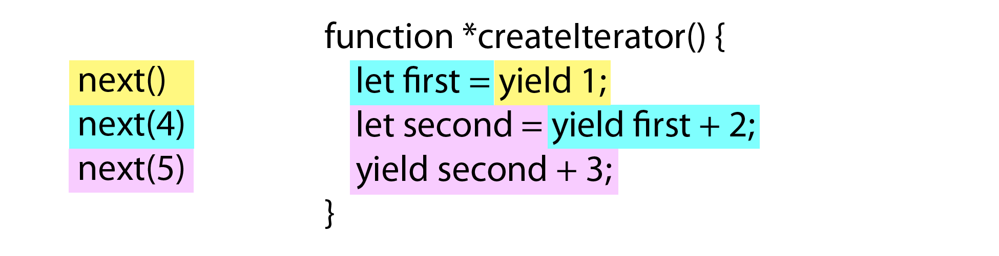

# Iterators and Generators

Iterators have been used in many programming languages as a way to more easily work with collections of data. Many languages have moved away from needing to use `for` loops, where initialization of variables that track position in a collection are necessary, to using iterator objects that programmatically return the next item in a collection. In ECMAScript 6, JavaScript adds iterators as an important feature of the language. When coupled with new array methods and new types of collections (such as sets and maps), iterators become even more important for efficient processing of data.

## The Loop Problem

If you've ever written JavaScript, chances are you've written some code that looks like this:

```js
var colors = ["red", "green", "blue"];

for (var i=0, len < colors.length; i < len; i++) {
    console.log(colors[i]);
}
```

This is a standard `for` loop that sets up the variable `i` to track the index into the array. The value of `i` is incremented each time through the loop if it's not larger than the length of the array (stored in `len`). While this is a fairly straightforward example, the complexity grows when you nest loops and need to keep track of multiple variables. This additional complexity can lead to errors, and the boilerplate nature of the code lends itself to more errors as similar code is written in multiple places. This is the problem that iterators are meant to solve.

## What are Iterators?

Iterators are nothing more than objects with a specific interface. That interface consists of a method called `next()` that returns a result object. The result object has two properties, `value`, which is the next value, and `done`, which is a boolean value that's `true` when there are no more values to return. The iterator keeps an internal pointer to a location within a collection of values and, with each call to `next()`, returns the next appropriate value.

If you call `next()` after the last value has been returned, the method returns `done` as `true` and `value` contains the return value for the iterator. The *return value* is not considered part of the data set, but rather a final piece of related data or `undefined` if no such data exists. (This concept will become clearer in the generators section later in this chapter.)

With that understanding, it's fairly easy to create an iterator using ECMAScript 5, for example:

```js
function createIterator(items) {

    var i = 0;

    return {
        next: function() {

            var done = (i >= items.length);
            var value = !done ? items[i++] : undefined;

            return {
                done: done,
                value: value
            };

        }
    };
}

var iterator = createIterator([1, 2, 3]);

console.log(iterator.next());           // "{ value: 1, done: false }"
console.log(iterator.next());           // "{ value: 2, done: false }"
console.log(iterator.next());           // "{ value: 3, done: false }"
console.log(iterator.next());           // "{ value: undefined, done: true }"

// for all further calls
console.log(iterator.next());           // "{ value: undefined, done: true }"
```

The `createIterator()` function in this example returns an object with a `next()` method. Each time the method is called, the next value in the `items` array is returned as `value`. When `i` is 3, `items[i++]` returns `undefined` and `done` is `true`, which fulfills the special last case for iterators in ECMAScript 6.

You might be thinking that iterators look interesting but seem complex to write. Indeed, writing iterators so that they adhere to the correct behavior is a bit difficult, which is why ECMAScript 6 provides generators.

## Generators

A *generator* is a special kind of function that returns an iterator. Generator functions are indicated by inserting a star character (`*`) after the `function` keyword (it doesn't matter if the star is directly next to `function` or if there's some whitespace between them). The `yield` keyword is used inside of generators to specify the values that the iterator should return when `next()` is called. So if you want to return three different values for each successive call to `next()`, you can do so as follows:

```js
// generator
function *createIterator() {
    yield 1;
    yield 2;
    yield 3;
}

// generators are called like regular functions but return an iterator
let iterator = createIterator();

console.log(iterator.next().value);     // 1
console.log(iterator.next().value);     // 2
console.log(iterator.next().value);     // 3
```

In this example, the `createIterator()` function is a generator (as indicated by the `*` before the name) and it's called like any other function. The value returned is an iterator. Multiple `yield` statements inside the generator indicate the progression of values that should be returned when `next()` is called on the iterator. First, `next()` should return `1`, then `2`, and then `3` before the iterator is finished.

Perhaps the most interesting aspect of generator functions is that they stop execution after each `yield` statement, so `yield 1` executes and then the function doesn't execute anything else until the iterator's `next()` method is called. At that point, execution resumes with the next statement after `yield 1`, which in this case is `yield 2`. This ability to stop execution in the middle of a function is extremely powerful and lends to some interesting uses of generator functions (discussed later in this chapter).

The `yield` keyword can be used with any value or expression, so you can do interesting things like use `yield` inside of a `for` loop:

```js
function *createIterator(items) {
    for (let i=0; i < items.length; i++) {
        yield items[i];
    }
}

let iterator = createIterator([1, 2, 3]);

console.log(iterator.next());           // "{ value: 1, done: false }"
console.log(iterator.next());           // "{ value: 2, done: false }"
console.log(iterator.next());           // "{ value: 3, done: false }"
console.log(iterator.next());           // "{ value: undefined, done: true }"

// for all further calls
console.log(iterator.next());           // "{ value: undefined, done: true }"
```

In this example, an array is used in a `for` loop, yielding each item as the loop progresses. Each time `yield` is encountered, the loop stops, and each time `next()` is called on `iterator`, the loop picks back up where it left off.

Generator functions are an important part of ECMAScript 6, and since they are just functions, they can be used in all the same places.

### Generator Function Expressions

Generators can be created using function expressions in the same way as using function declarations by including a star (`*`) character between the `function` keyword and the opening paren, for example:

```js
let createIterator = function *(items) {
    for (let i=0; i < items.length; i++) {
        yield items[i];
    }
};

let iterator = createIterator([1, 2, 3]);

console.log(iterator.next());           // "{ value: 1, done: false }"
console.log(iterator.next());           // "{ value: 2, done: false }"
console.log(iterator.next());           // "{ value: 3, done: false }"
console.log(iterator.next());           // "{ value: undefined, done: true }"

// for all further calls
console.log(iterator.next());           // "{ value: undefined, done: true }"
```

In this code, `createIterator()` is a generator function expression rather than a function declaration (as in the previous example). Since the function expression is anonymous, the asterisk is between the `function` keyword and the opening parentheses. Otherwise, this example is the same as the previous one using a generator function declaration.

I> It is not possible to create an arrow function that is also a generator.

### Generator Object Methods

Because generators are just functions, they can be added to objects the same way as any other functions. For example, you can use an ECMAScript 5-style object literal with a function expression:

```js
var o = {

    createIterator: function *(items) {
        for (let i=0; i < items.length; i++) {
            yield items[i];
        }
    }
};

let iterator = o.createIterator([1, 2, 3]);
```

You can also use the ECMAScript 6 method shorthand by prepending the method name with a star (`*`):

```js
var o = {

    *createIterator(items) {
        for (let i=0; i < items.length; i++) {
            yield items[i];
        }
    }
};

let iterator = o.createIterator([1, 2, 3]);
```

This example is functionally equivalent to the previous one, the only difference is the syntax used. Because the method is defined using shorthand and there is no `function` keyword, the star is placed immediately before the method name (though there may be whitespace between the star and the method name).

## Iterables and for-of

Closely related to the concept of an iterator is an iterable. An *iterable* is an object with a `@@iterator` symbol property. The well-known `@@iterator` symbol specifies a function that returns an iterator for the given object. All of the collection objects, including arrays, sets, and maps, as well as strings, are iterables in ECMAScript 6 and so have a default iterator specified. Iterables are designed to be used with a new addition to ECMAScript: the `for-of` loop.

I> All iterators created by generators are also iterables, as generators assign the `@@iterator` property by default.

The `for-of` loop is the second part of the solution to the problem introduced at the beginning of this chapter. Instead of requiring you to track an index into a collection, the `for-of` loop works by calling `next()` on an iterable each time through the loop and storing the `value` from the result object in a variable. The loop continues this process until the `done` property of the returned object is `true`. For example:

```js
let values = [1, 2, 3];

for (let num of values) {
    console.log(num);
}
```

This code outputs the following:

```
1
2
3
```

The `for-of` loop in this example is first calling the `@@iterator` method of the array to retrieve an iterator (as mentioned earlier, all arrays are iterables). Next, `iterator.next()` is called and the `value` property on the result object is read into `num`. So `num` is first 1, then 2, and finally 3. When `done` on the result object is `true`, the loop exits, so `num` is never assigned the value of `undefined`.

The advantage of the `for-of` loop as opposed to the traditional `for` loop is that you never have to keep track of an index into a collection. Instead, you can just focus on working with the contents of the collection.

W> The `for-of` statement will throw an error when used on, a non-iterable, `null`, or `undefined`.

### Accessing the Default Iterator

You can access the default iterator for an object using `Symbol.iterator`, for example:

```js
let values = [1, 2, 3];
let iterator = values[Symbol.iterator]();

console.log(iterator.next());           // "{ value: 1, done: false }"
console.log(iterator.next());           // "{ value: 2, done: false }"
console.log(iterator.next());           // "{ value: 3, done: false }"
console.log(iterator.next());           // "{ value: undefined, done: true }"
```

This code gets the default iterator for `values` and uses that to iterate over the values in the array. This is the same process that happens behind-the-scenes when using a `for-of` loop.

Knowing that `Symbol.iterator` specifies the default iterator, it's possible to detect if an object is iterable by using the following:

```js
function isIterable(object) {
    return typeof object[Symbol.iterator] === "function";
}

console.log(isIterable([1, 2, 3]));     // true
console.log(isIterable("Hello"));       // true
console.log(isIterable(new Map()));     // true
console.log(isIterable(new Set()));     // true
console.log(isIterable(new WeakMap())); // false
console.log(isIterable(new WeakSet())); // false
```

The `isIterable()` function simply checks to see if a default iterator exists on the object and is a function. This is similar to the check that the `for-of` loop does before executing.

Now that you know about accessing the default iterator using `Symbol.iterator`, you can also use that property to create your own iterables.

### Creating Iterables

Developer-defined objects are not iterable by default, but you can make them iterable by creating a `Symbol.iterator` property containing a generator. For example:

```js
let collection = {
    items: [],
    *[Symbol.iterator]() {
        for (let item of this.items) {
            yield item;
        }
    }

};

collection.items.push(1);
collection.items.push(2);
collection.items.push(3);

for (let x of collection) {
    console.log(x);
}

// Output:
// 1
// 2
// 3
```

This code defines a default iterator for a variable called `collection` using object literal method shorthand and a computed property using `Symbol.iterator` (note the star still comes before the name). The generator then uses a `for-of` loop to iterate over the values in `this.items` and uses `yield` to return each one. So instead of manually iterating defining values to return as part of the default iterator, the `collection` object relies on the default iterator of `this.items` to do the work.

I> Another approach to using the iterator of another object is to use delegating generators, a topic discussed later in this chapter.

So far you've seen some uses for the default array iterator, but there are many more iterators built in to ECMAScript 6 to make working with collections of data easy.

## Built-in Iterators

Iterators are an important part of ECMAScript 6 and, as such, iterators are available on many objects by default. You don't need to create your own iterators for many of the built-in types because the language has them already. You only need to create iterators when you find that the built-in ones don't serve your purpose, most frequently when defining your own objects or classes. Otherwise, you can rely on the built-in iterators to do your work. Perhaps the most common iterators to use are those that work on collections.

### Collection Iterators

ECMAScript 6 has three types of collection objects: arrays, maps, and sets. All three have the same built-in iterators to help you navigate their content. You can retrieve an iterator for a collection by calling one of these methods:

* `entries()` - returns an iterator whose values are a key-value pair.
* `values()` - returns an iterator whose values are the values of the collection.
* `keys()` - returns an iterator whose values are the keys contained in the collection.

The `entries()` iterator returns a two-item array each time `next()` is called. The two-item array represents the key and value for each item in the collection. For arrays, the first item is the numeric index; for sets, the first item is also the value (since values double as keys in sets); for maps, the first item is the key. Here are some examples:

```js
let colors = [ "red", "green", "blue" ];
let tracking = new Set([1234, 5678, 9012]);
let data = new Map();

data.set("title", "Understanding ECMAScript 6");
data.set("format", "ebook");

for (let entry of colors.entries()) {
    console.log(entry);
}

for (let entry of tracking.entries()) {
    console.log(entry);
}

for (let entry of data.entries()) {
    console.log(entry);
}
```

This example outputs the following:

```
[0, "red"]
[1, "green"]
[2, "blue"]
[1234, 1234]
[5678, 5678]
[9012, 9012]
["title", "Understanding ECMAScript 6"]
["format", "ebook"]
```

This code uses the `entries()` method on each type of collection to retrieve an iterator and `for-of` loops to iterate the items. From the console output, you can see the keys and values returned in pairs for each object.

The `values()` iterator simply returns the values as they are stored in the collection. For example:

```js
let colors = [ "red", "green", "blue" ];
let tracking = new Set([1234, 5678, 9012]);
let data = new Map();

data.set("title", "Understanding ECMAScript 6");
data.set("format", "ebook");

for (let value of colors.values()) {
    console.log(value);
}

for (let value of tracking.values()) {
    console.log(value);
}

for (let value of data.values()) {
    console.log(value);
}
```

This example outputs the following:

```
"red"
"green"
"blue"
1234
5678
9012
"Understanding ECMAScript 6"
"ebook"
```

In this case, using `values()` returns the exact data contained in the collection without any information as to its location.

The `keys()` iterator returns each key present in the collection. For arrays, this is the numeric keys only (it never returns other own properties of the array); for sets, the keys are the same as the values and so `keys()` and `values()` return the same iterator; for maps, this is each unique key. Here's an example:

```js
let colors = [ "red", "green", "blue" ];
let tracking = new Set([1234, 5678, 9012]);
let data = new Map();

data.set("title", "Understanding ECMAScript 6");
data.set("format", "ebook");

for (let key of colors.keys()) {
    console.log(key);
}

for (let key of tracking.keys()) {
    console.log(key);
}

for (let key of data.keys()) {
    console.log(key);
}
```

This example outputs the following:

```
0
1
2
1234
5678
9012
"title"
"format"
```

When using the `keys()` iterator, you'll receive only the corresponding keys in the collection. For arrays, this means you'll only receive numeric indices even if you've added named properties to array object. This is different from the way the `for-in` loop works with arrays because the `for-in` loop iterates over properties rather than just the numeric indices.

Additionally, each collection type has a default iterator that is used by `for-of` whenever an iterator isn't explicitly specified. The default iterator for arrays and sets is `values()` while the default iterator for maps is `entries()`. This makes it a little bit easier to use collection objects in `for-of`:

```js
let colors = [ "red", "green", "blue" ];
let tracking = new Set([1234, 5678, 9012]);
let data = new Map();

data.set("title", "Understanding ECMAScript 6");
data.set("format", "ebook");

// same as using colors.values()
for (let value of colors) {
    console.log(value);
}

// same as using tracking.values()
for (let num of tracking) {
    console.log(num);
}

// same as using data.entries()
for (let entry of data) {
    console.log(entry);
}
```

This example outputs the following:

```
"red"
"green"
"blue"
1234
5678
9012
["title", "Understanding ECMAScript 6"]
["format", "ebook"]
```

The default iterators for arrays, sets, and maps are designed to work similarly to how these objects are initialized. So arrays and sets return their values by default while maps return the same array format that can be passed into the `Map` constructor. This is useful when used in `for-of` loops with destructuring, as in this example:

```js
let data = new Map();

data.set("title", "Understanding ECMAScript 6");
data.set("format", "ebook");

// same as using data.entries()
for (let [key, value] of data) {
    console.log(key + "=" + value);
}
```

The `for-of` loop in this example uses a destructured array to assign `key` and `value` for each entry in the map. In this way, you can easily work with keys and values at the same time without needing to access a two-item array.

W> Weak sets and weak maps do not have any built-in iterators. Managing weak references means there's no way to know exactly how many values are in these collections, which also means there's no way to iterate over them.

### String Iterators

Beginning with ECMAScript 5, JavaScript strings have slowly been evolving to be more array-like. For example, ECMAScript 5 formalizes bracket notation for accessing characters in strings (`text[0]` to get the first character). Unfortunately, bracket notation works on code units rather than characters, so it cannot be used to access double-byte characters correctly. ECMAScript 6 has added a lot of functionality to fully support Unicode (see Chapter 2) and as such, the default iterator for strings works on characters rather than code units.

Using bracket notation and the `length` property, the code units are used instead of characters and the output is a bit unexpected:


```js
var message = "A 𠮷 B";

for (let i=0; i < message.length; i++) {
    console.log(message[i]);
}
```

This code outputs the following:

```
A
(blank)
(blank)
(blank)
(blank)
B
```

Since the double-byte character is treated as two separate code units, there are four empty lines between `A` and `B` in the output.

Using the default string iterator with a `for-of` loop results in a more appropriate result:


```js
var message = "A 𠮷 B";

for (let c of message) {
    console.log(c);
}
```

This code outputs the following:

```
A
(blank)
𠮷
(blank)
B
```

This output is more in line with what you might expect when working with characters. The default string iterator is ECMAScript 6's attempt at solving the iteration problem by using characters instead of code units.

### NodeList Iterators

In the Document Object Model (DOM), there is a `NodeList` type that represents a collection of elements in a document. For those who write JavaScript to run in web browsers, understanding the difference between `NodeList` objects and arrays has always been a bit difficult. Both use the `length` property to indicate the number of items and both use bracket notation to access individual items. However, internally a `NodeList` and an array behave quite differently, and so that has led to a lot of confusion.

With the addition of default iterators in ECMAScript 6, the DOM definition of `NodeList` now specifically includes a default iterator that behaves in the same manner as the array default iterator. That means you can use `NodeList` in a `for-of` loop or any other place that uses an object's default iterator. For example:

```js
var divs = document.getElementsByTagName("div");

for (let div of divs) {
    console.log(div.id);
}
```

This code uses `getElementsByTagName()` method to retrieve a `NodeList` that represents all of the `<div>` elements in the document. The `for-of` loop then iterates over each element and outputs its ID, effectively making the code the same as it would be for a standard array.

## The Spread Operator

In Chapter 7, you saw how the spread operator (`...`) can be used to convert a set into an array. For example:

```js
let set = new Set([1, 2, 3, 3, 3, 4, 5]),
    array = [...set];

console.log(array);             // [1,2,3,4,5]
```

This code uses the spread operator inside of an array literal to fill in an array with the values from `set`. The spread operator works on all iterables and uses the default iterator to determine which values to include. All values are read from the iterator and then inserted into the array in the location of the spread operator and in the order in which values where returned from the iterator. This example works because sets are iterables, but it can work equally well on any iterable. Here's another example:

```js
let map = new Map([ ["name", "Nicholas"], ["age", 25]]),
    array = [...map];

console.log(array);         // [ ["name", "Nicholas"], ["age", 25]]
```

Here, `map` is converted into an array of arrays by using the spread operator. Since the default iterator for maps returns key-value pairs, the resulting array looks like the array that was passed into `new Map()`.

You're not limited to the number of times you can use the spread operator in an array literal. You can use it wherever you want to insert multiple items from an iterable. For example:

```js
let smallNumbers = [1, 2, 3],
    bigNumbers = [100, 101, 102],
    allNumbers = [0, ...smallNumbers, ...bigNumbers];

console.log(allNumbers.length);     // 7
console.log(allNumbers);    // [0, 1, 2, 3, 100, 101, 102]
```

Here, the spread operator is used to create `allNumbers` from the values in `smallNumbers` and `bigNumbers`. The values end up in the order in which the arrays appear in the array literal, so zero is first, followed by the values from `smallNumbers`, followed by the values from `bigNumbers`. Keep in mind that the original arrays are unchanged, only the values from those arrays have been copied into `allNumbers`.

Since the spread operator can be used on any iterable, it's the easiest way to convert an iterable into an array. That means you can convert strings into an array of characters (not code units) and `NodeList` objects in the browser in an array of nodes.

Now that you understand the basics of how iterators work, including `for-of` and the spread operator, it's time to look at some of the more complex uses of iterators.

## Advanced Functionality

There's a lot that can be accomplished with the basic functionality of iterators and the convenience of creating them using generators. However, developers have discovered that iterators are much more powerful when used for tasks other than simply iterating over a collection of values. During the development of ECMAScript 6, a lot of unique ideas and patterns emerged that caused the addition of more functionality. Some of the changes are subtle, but when used together, can accomplish some interesting interactions.

### Passing Arguments to Iterators

Throughout this chapter, you've seen that iterators can pass values out via the `next()` method or by using `yield` in a generator. It's also possible to pass arguments into the iterator through the `next()` method. When an argument is passed to `next()`, it becomes the value of the `yield` statement inside a generator. For example:

```js
function *createIterator() {
    let first = yield 1;
    let second = yield first + 2;       // 4 + 2
    yield second + 3;                   // 5 + 3
}

let iterator = createIterator();

console.log(iterator.next());           // "{ value: 1, done: false }"
console.log(iterator.next(4));          // "{ value: 6, done: false }"
console.log(iterator.next(5));          // "{ value: 8, done: false }"
console.log(iterator.next());           // "{ value: undefined, done: true }"
```

The first call to `next()` is a special case where any argument passed to it is lost. Since arguments passed to `next()` become the value returned by `yield`, there would have to be a way to access that argument before the first `yield` in the generator function. That's not possible, so there's no reason to pass an argument the first time `next()` is called.

On the second call to `next()`, the value `4` is passed as the argument. The `4` ends up assigned to the variable `first` inside the generator function. In a `yield` statement including an assignment the right side of the expression is evaluated on the first call to `next()` and the left side is evaluated on the second call to `next()` before the function continues executing. Since the second call to `next()` passes in `4`, that value is assigned to `first` and then execution continues.

The second `yield` uses the result of the first `yield` and adds two, which means it returns a value of six. When `next()` is called a third time, the value `5` is passed as an argument. That value is assigned to the variable `second` and then used in the third `yield` statement to return eight.

It's a bit easier to think about what's happening by considering which code is executing each time execution continues inside the generator function. Figure 6-1 uses colors to show the code being executed before yielding.



<!--NOTE: I used an image with colors for this, but since we don't print in color, I'm not sure how to represent this in the print book. Let me know if you have a suggestion for how to represent this better. -->

The color yellow represents the first call to `next()` and all of the code that is executed inside of the generator as a result; the color aqua represents the call to `next(4)` and the code that is executed; the color purple represents the call to `next(5)` and the code that is executed as a result. The tricky part is the code on the right side of each expression executing and stopping before the left side is executed. This makes debugging complicated generators a bit more involved than regular functions.

So far, you've seen that `yield` can act like `return` when a value is passed to `next()`. However, that's not the only execution trick inside of generators. You can also cause iterators throw an error.

### Throwing Errors in Iterators

It's not only possible to pass data into iterators, it's also possible to pass error conditions. Iterators can choose to implement a `throw()` method that instructs the iterator to throw an error when it resumes. You can pass in an error object that should be thrown when the iterator continues processing. For example:

```js
function *createIterator() {
    let first = yield 1;
    let second = yield first + 2;       // yield 4 + 2, then throw
    yield second + 3;                   // never is executed
}

let iterator = createIterator();

console.log(iterator.next());                   // "{ value: 1, done: false }"
console.log(iterator.next(4));                  // "{ value: 6, done: false }"
console.log(iterator.throw(new Error("Boom"))); // error thrown from generator
```

In this example, the first two `yield` expressions are evaluated as normal, but when `throw()` is called, an error is thrown before `let second` is evaluated. This effectively halts code execution similar to directly throwing an error. The only difference is the location in which the error is thrown. Figure 6-2 shows which code is executed at each step.


<!-- Same here. Suggestions welcome! -->

In this figure, the color red represents the code executed when `throw()` is called and the red star shows approximately when the error is thrown inside the generator. The first two `yield` statements are executed, it's only when `throw()` is called that an error is thrown before any other code is executed. Knowing this, it's possible to catch such errors inside the generator using a `try-catch` block, such as:

```js
function *createIterator() {
    let first = yield 1;
    let second;

    try {
        second = yield first + 2;       // yield 4 + 2, then throw
    } catch (ex) {
        second = 6;                     // on error, assign a different value
    }
    yield second + 3;
}

let iterator = createIterator();

console.log(iterator.next());                   // "{ value: 1, done: false }"
console.log(iterator.next(4));                  // "{ value: 6, done: false }"
console.log(iterator.throw(new Error("Boom"))); // "{ value: 9, done: false }"
console.log(iterator.next());            // "{ value: undefined, done: true }"
```

In this example, a `try-catch` block is wrapped around the second `yield` statement. While this `yield` executes without error, the error is thrown before any value can be assigned to `second`, so the `catch` block assigns it a value of six. Execution then flows to the next `yield` and returns nine.

You'll also notice something interesting happened - the `throw()` method returned a value similar to that returned by `next()`. Because the error was caught inside the generator, code execution continued on to the next `yield` and returned the appropriate value.

It helps to think of `next()` and `throw()` as both being instructions to the iterator: `next()` instructs the iterator to continue executing (possibly with a given value) and `throw()` instructs the iterator to continue executing by throwing an error. What happens after that point depends on the code inside the generator.

The `next()` and `throw()` methods control execution inside of an iterator when using `yield`, but you can also use the `return` statement. However, it works a bit differently than in regular functions.

### Generator Return Statements

Since generators are functions, you can use the `return` statement both to exit early and to specify a return value for the last call to `next()`. For most of this chapter you've seen examples where the last call to `next()` on an iterator returns `undefined`. It's possible to specify an alternate value by using `return` as you would in any other function. In a generator, `return` indicates that all processing is done, so the `done` property is set to `true` and the value, if provided, becomes the `value` field. Here's an example that simply exits early using `return`:

```js
function *createIterator() {
    yield 1;
    return;
    yield 2;
    yield 3;
}

let iterator = createIterator();

console.log(iterator.next());           // "{ value: 1, done: false }"
console.log(iterator.next());           // "{ value: undefined, done: true }"
```

In this code, the generator has a `yield` statement followed by a `return` statement. The `return` indicates that there are no more values to come and so the rest of the `yield` statements will not execute (they are unreachable).

You can also specify a return value that will end up in the `value` field of the returned object. For example:

```js
function *createIterator() {
    yield 1;
    return 42;
}

let iterator = createIterator();

console.log(iterator.next());           // "{ value: 1, done: false }"
console.log(iterator.next());           // "{ value: 42, done: true }"
console.log(iterator.next());           // "{ value: undefined, done: true }"
```

Here, the value `42` is returned in the `value` field on the second call to `next()` (which is the first time that `done` is `true`). The third call to `next()` returns an object whose `value` property is once again `undefined`. Any value you specify with `return` is only available on the returned object one time before the `value` field is reset to `undefined`.

I> Any value specified by `return` is ignored by `for-of` and the spread operator. As soon as they see `done` is `true`, they stop without reading the `value`.

### Delegating Generators

In some cases it may be useful to combine the values from two iterators into one. Using generators, it's possible to delegate to another generator using a special form of `yield` with a star (`*`). As with generator definitions, it doesn't matter where the star appears so as long as it is between the keyword `yield` and the generator function name. Here's an example:

```js
function *createNumberIterator() {
    yield 1;
    yield 2;
}

function *createColorIterator() {
    yield "red";
    yield "green";
}

function *createCombinedIterator() {
    yield *createNumberIterator();
    yield *createColorIterator();
    yield true;
}

var iterator = createCombinedIterator();

console.log(iterator.next());           // "{ value: 1, done: false }"
console.log(iterator.next());           // "{ value: 2, done: false }"
console.log(iterator.next());           // "{ value: "red", done: false }"
console.log(iterator.next());           // "{ value: "green", done: false }"
console.log(iterator.next());           // "{ value: true, done: false }"
console.log(iterator.next());           // "{ value: undefined, done: true }"
```

In this example, the `createCombinedIterator()` generator delegates first to `createNumberIterator()` and then to `createColorIterator()`. The returned iterator appears, from the outside, to be one consistent iterator that has produced all of the values. Each call to `next()` is delegated to the appropriate iterator until they are empty, and then the final `yield` is executed to return `true`.

Generator delegation also lets you make use of generator return values (as seen in the previous section). This is the easiest way to access such returned values and can be quite useful in performing complex tasks. For example:

```js
function *createNumberIterator() {
    yield 1;
    yield 2;
    return 3;
}

function *createRepeatingIterator(count) {
    for (let i=0; i < count; i++) {
        yield "repeat";
    }
}

function *createCombinedIterator() {
    let result = yield *createNumberIterator();
    yield *createRepeatingIterator(result);
}

var iterator = createCombinedIterator();

console.log(iterator.next());           // "{ value: 1, done: false }"
console.log(iterator.next());           // "{ value: 2, done: false }"
console.log(iterator.next());           // "{ value: "repeat", done: false }"
console.log(iterator.next());           // "{ value: "repeat", done: false }"
console.log(iterator.next());           // "{ value: "repeat", done: false }"
console.log(iterator.next());           // "{ value: undefined, done: true }"
```

Here, the `createCombinedIterator()` generator delegates to `createNumberIterator()` and assigns the return value to `result`. Since `createNumberIterator()` contains `return 3`, the returned value is `3`. The `result` variable is then passed to `createRepeatingIterator()` as an argument indicating how many times to yield the same string (in this case, three times).

Notice that the value `3` was never output from any call to `next()`, it existed solely inside of `createCombinedIterator()`. It is possible to output that value as well by adding another `yield` statement, such as:

```js
function *createNumberIterator() {
    yield 1;
    yield 2;
    return 3;
}

function *createRepeatingIterator(count) {
    for (let i=0; i < count; i++) {
        yield "repeat";
    }
}

function *createCombinedIterator() {
    let result = yield *createNumberIterator();
    yield result;
    yield *createRepeatingIterator(result);
}

var iterator = createCombinedIterator();

console.log(iterator.next());           // "{ value: 1, done: false }"
console.log(iterator.next());           // "{ value: 2, done: false }"
console.log(iterator.next());           // "{ value: 3, done: false }"
console.log(iterator.next());           // "{ value: "repeat", done: false }"
console.log(iterator.next());           // "{ value: "repeat", done: false }"
console.log(iterator.next());           // "{ value: "repeat", done: false }"
console.log(iterator.next());           // "{ value: undefined, done: true }"
```

In this code, the extra `yield` statement explicitly outputs the returned value from `createNumberIterator()`.

Generator delegation using the return value is a very powerful paradigm that allows for some very interesting possibilities, especially when used in conjunction with asynchronous operations.

I> You can use `yield *` directly on strings, such as `yield * "hello"` and the string's default iterator will be used.

## Asynchronous Task Running

A lot of the excitement around generators is directly related to usage with asynchronous programming. Asynchronous programming in JavaScript is a double-edged sword: it's very easy to do simple things while complex things become an errand in code organization. Since generators allow you to effectively pause code in the middle of execution, this opens up a lot of possibilities as it relates to asynchronous processing.

The traditional way to perform asynchronous operations is to call a function that has a callback. For example, consider reading a file from disk in Node.js:

```js
let fs = require("fs");

fs.readFile("config.json", function(err, contents) {
    if (err) {
        throw err;
    }

    doSomethingWith(contents);
    console.log("Done");
});
```

The `fs.readFile()` method is called with the filename to read and a callback function. When the operation is finished, the callback function is called. The callback checks to see if there's an error, and if not, processes the returned `contents`. This works well when you have a small, finite number of asynchronous tasks to complete, but gets complicated when you need to nest callbacks or otherwise sequence a series of asynchronous tasks. This is where generators and `yield` are helpful.

### A Simple Task Runner

Because `yield` stops execution and waits for the `next()` method to be called before starting again, this provides a way to implement asynchronous calls without managing callbacks. To start, you need a function that can call a generator and start the iterator, such as:

```js
function run(taskDef) {

    // create the iterator, make available elsewhere
    let task = taskDef();

    // start the task
    let result = task.next();

    // recursive function to keep calling next()
    function step() {

        // if there's more to do
        if (!result.done) {
            result = task.next();
            step();
        }
    }

    // start the process
    step();

}
```

The `run()` function accepts a task definition (a generator function) as an argument. It calls the generator to create an iterator and stores the iterator in `task`. The `task` variable is outside of the function so it can be accessed by other functions (the reason why will be clear later in this section). The first call to `next()` begins the iterator and the result is stored for later use. The function `step()` checks to see if `result.done` is false and, if so, calls `next()` before recursively calling itself. Each call to `next()` stores the return value in `result`, so that variable is always overwritten to contain the latest information. The initial call to `step()` starts the process of looking at `result.done`.

With this implementation of `run()`, you can run a generator containing multiple `yield` statements, such as:

```js
run(function*() {
    console.log(1);
    yield;
    console.log(2);
    yield;
    console.log(3);
});
```

This example just outputs three numbers to the console, which simply shows that all calls to `next()` are being made. However, just yielding a couple of times isn't very useful, so the next step is to pass values into and out of the iterator.

### Task Running With Data

The easiest way to pass data through the task runner is to pass the value specified by `yield` into the next call to `next()`. To do so, you need only pass `result.value`, as in this code:

```js
function run(taskDef) {

    // create the iterator, make available elsewhere
    let task = taskDef();

    // start the task
    let result = task.next();

    // recursive function to keep calling next()
    function step() {

        // if there's more to do
        if (!result.done) {
            result = task.next(result.value);
            step();
        }
    }

    // start the process
    step();

}
```

With this change, it's now possible to pass data back and forth, such as:

```js
run(function*() {
    let value = yield 1;
    console.log(value);         // 1

    value = yield value + 3;
    console.log(value);         // 4
});
```

This example outputs two values to the console: 1 and 4. The value 1 comes from `yield 1`, as the 1 is being passed right back into the variable `value`. The 4 is calculated by adding 3 to `value` and passing that result back to `value`. Now that data is flowing between calls to `yield`, it's just a small change to allow asynchronous calls.

### Asynchronous Task Runner

Whereas the previous example passed static data back and forth, waiting for an asynchronous process is slightly different. The task runner needs to know about callbacks and how to use them. And since `yield` expressions pass their values into the task runner, that means any function call must return a value that somehow indicates it's an asynchronous operation that the task runner should wait for. How can you signal that?

For the purposes of this example, any function meant to be called by the task runner will return a function that executes a callback. For example:

```js
function fetchData() {
    return function(callback) {
        callback(null, "Hi!");
    };
}
```

The `fetchData()` function returns a function that accepts a callback function as an argument. When the returned function is called, it executes the callback function with a single piece of data, the string `"Hi!"`. The `callback` argument needs to come from the task runner and ensure that calling it correctly interacts with the underlying iterator. While the `fetchData()` function is synchronous, you can easily extend it to be asynchronous by calling the callback with a slight delay, such as:

```js
function fetchData() {
    return function(callback) {
        setTimeout(function() {
            callback(null, "Hi!");
        }, 50);
    };
}
```

This version of `fetchData()` introduces a 50ms delay before calling the callback, demonstrating that this pattern works equally well for synchronous and asynchronous code. You just have to make sure each function that wants to be called using `yield` follows this same pattern.

With a good understanding of how functions signal that they are an asynchronous process, you can modify the task runner to take this into account. Anytime `result.value` is a function, the task runner will execute it instead of just passing that value into `next()`. Here's the updated code:

```js
function run(taskDef) {

    // create the iterator, make available elsewhere
    let task = taskDef();

    // start the task
    let result = task.next();

    // recursive function to keep calling next()
    function step() {

        // if there's more to do
        if (!result.done) {
            if (typeof result.value === "function") {
                result.value(function(err, data) {
                    if (err) {
                        result = task.throw(err);
                        return;
                    }

                    result = task.next(data);
                    step();
                });
            } else {
                result = task.next(result.value);
                step();
            }

        }
    }

    // start the process
    step();

}
```

When `result.value` is a function, it is called with a callback function. That callback function follows the Node.js convention of passing any possible error as the first argument and the result as the second argument. If `err` is present, then that means an error occurred and `task.throw()` is called with the error object instead of `task.next()` so an error is thrown at the correct location. If there is no error, then `data` is passed into `task.next()` and the result is stored. Then, `step()` is called to continue the process. When `result.value` is not a function, it is directly passed into `next()` just as before.

This new version of the task runner is ready for all asynchronous tasks. To read data from a file in Node.js, you need to create a wrapper around `fs.readFile()` that returns a function similar to the `fetchData()` function from earlier in this section. For example:

```js
let fs = require("fs");

function readFile(filename) {
    return function(callback) {
        fs.readFile(filename, callback);
    };
}
```

The `readFile()` method accepts a single argument, the filename, and returns a function that calls a callback. The callback is passed directly to `fs.readFile()`, which will execute it upon completion. You can then run this task using `yield` as follows:

```js
run(function*() {
    let contents = yield readFile("config.json");
    doSomethingWith(contents);
    console.log("Done");
});
```

This example is performing the asynchronous `readFile()` operation without making any callbacks visible in the main code. Aside from `yield`, the code looks the same as synchronous code. As long as the functions performing asynchronous operations all conform to the same interface, you can write logic that reads like synchronous code.

Of course, there are downsides to the pattern used in these examples, namely that you can't always be sure that a function that returns a function is asynchronous. For now, though, it's only important that you understand the theory behind the task running. There are more powerful ways of doing asynchronous task scheduling using promises, and that will be covered further in Chapter 11.

## Summary

Iterators are an important part of ECMAScript 6 and are at the root of several important parts of the language. On the surface, iterators provide a simple way to return a sequence of values using a simple API. However, there are far more complex ways to use iterators in ECMAScript 6.

The `@@iterator` symbol is used to define default iterators for objects. Both built-in objects and developer-defined objects can use this symbol to provide a method that returns an iterator. When `@@iterator` is provided, the object is considered an iterable.

The `for-of` loop uses iterables to return a series of values in a loop. This makes creating loops easier than the traditional `for` loop because you no longer need to track values and control when the loop ends. The `for-of` loop automatically reads all values from the iterator until there are no more and then exits.

To make it easier to use `for-of`, many values in ECMAScript 6 have default iterators. All the collection types, arrays, maps, and sets, have iterators designed for easy access to their contents. Strings also have a default iterator so it's easy to iterate over the characters of the string (rather than the code units).

The spread operator works with any iterable and makes it easy to convert iterables into arrays. It does this by reading values from an iterator and inserting them individually into an array.

Generators are a special type of function that automatically creates an iterator when called. These functions are indicated by the start (`*`) and make use of the `yield` keyword to indicate which value to return for each successive call to `next()`.

Generator delegation encourages good encapsulation of iterator behavior by letting you reuse existing generators in new ones. This is done using `yield *` instead of `yield`, allowing you to create an iterator that returns values from multiple iterators.

Perhaps the most interesting and exciting aspect of generators and iterators is the possibility of creating cleaner-looking asynchronous code. Instead of needing to use callbacks everywhere, you can setup code that looks synchronous but in fact uses `yield` to wait for asynchronous operations to complete.
